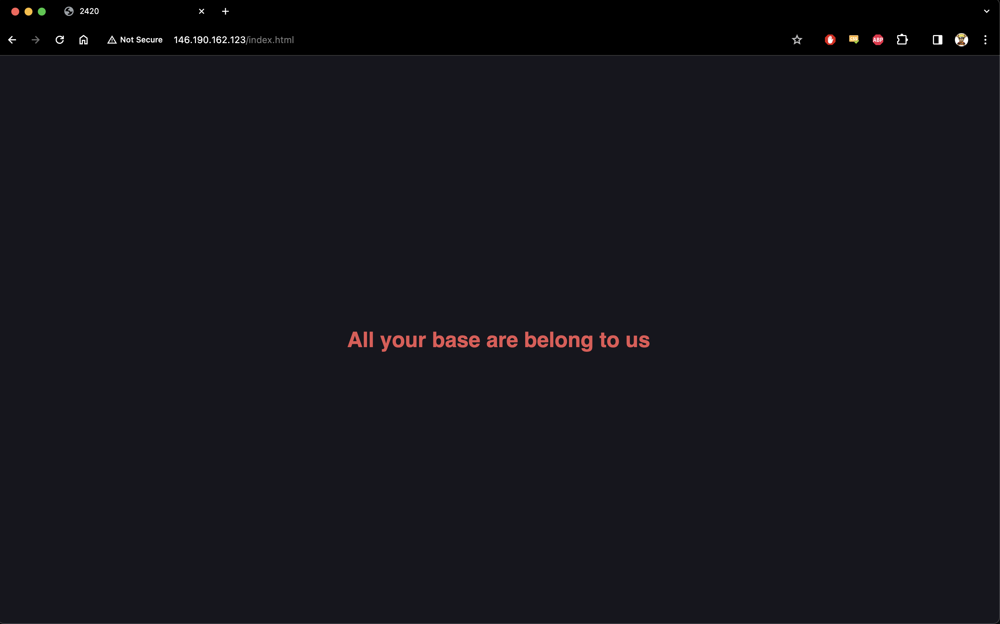

## Assignment #3

#### Charley Liao, A00969849, Set B

## Nginx Demo on Arch Linux

In this tutoprial, it will serve as a guide for a demo nginx server on a DigitalOcean droplet. This tutorial assumes an Arch Linux distro droplet has been created, and is started immediately post installation.

### Initial Configuration

#### Step 1:

SSH into your droplet:

```bash
ssh root@your_server_ip
```

#### Step 2:

Synchronize the pacman package manager database and run a system update:

```bash
sudo pacman -Syu
```

#### Step 3:

In this tutorial, we will be using the `vim` text editor, but any text editor will work. Continue by installing vim and nginx

```bash
sudo pacman -S vim
sudo pacman -S nginx
```

#### Step 4:

Create the root directory for your project (*NOT HOME DIRECTORY*).

```bash
sudo mkdir -p web/html/nginx-2420
```

This is where your website documents will be stored. For this demo, we will be using the following HTML document:

```html
<!DOCTYPE html>
<html lang="en">
    <head>
        <meta charset="UTF-8" />
        <meta name="viewport" content="width=device-width, initial-scale=1.0" />
        <title>2420</title>
        <style>
            * {
                color: #db4b4b;
                background: #16161e;
            }
            body {
                display: flex;
                align-items: center;
                justify-content: center;
                height: 100vh;
                margin: 0;
            }
            h1 {
                text-align: center;
                font-family: sans-serif;
            }
        </style>
    </head>
    <body>
        <h1>All your base are belong to us</h1>
    </body>
</html>
```

#### Step 5:

Copy and paste the below document into `/web/html/nginx-2420/index.html` however you could also use SFTP or another file transfer tool to upload this document.

```bash

# First create a file in /web/html/nginx-2420/
sudo touch index.html

# Then write the above text into the file
sudo vim index.html
```

#### At this stage, the nginx server is set but needs to be configured.

---

### Configuration of Seperate Server Block in nginx

#### Step 1:

**_NOTE:_**
This is **not** part of `nginx.conf`.

Create a new server block configuration for the site-pages. Configuration files that are stored in the sites-avaliable directory are configuration files for the virtual hosts.

```bash
sudo mkdir -p etc/nginx/sites-available
```

#### Step 2:

We will create a new server block for this site called nginx-2420 in the absolute path of `/etc/nginx/sites-available/nginx-2420.conf`.

Run the following command:

```bash
sudo vim /etc/nginx/sites-available/nginx-2420.conf
```

### Step 3:

In the nginx-2420 file, write the following configuration details. Make sure to replace `your_server_ip` with your droplet's public IP address.

```bash
# New server block
server {
    # Listen on port 80
    listen 80;
    listen [::]:80;
    # IP address the server is running on
    server_name "<your_server_ip>";

    # Point to the created root directory
    root /web/html/nginx-2420;
    # Point to the desired index page filename
    index index.php index.html index.htm;

    # Location block for handling requests
    # Attempt to serve URIs by first looking for an exact match of the filename.
    #If that does not exist, try serving it as a directory by appending a trailing slash.
    #If neither the filename nor directory exist, return a 404
    location / {
        try_files $uri $uri/ =404;
    }
}
```

We now have a separate server block nginx configuration to serve our index.html file.

#### Step 4:

In order for the server to run, we must create a symbolic link from the `sites-available` directory to the `sites-enabled` directory. To create a symbolic link, we run the following command:

```bash
sudo ln -s /etc/nginx/sites-available/nginx-2420.conf /etc/nginx/sites-enabled/nginx-2420.conf
```

#### Step 5:

We need to include the sites-enabled linked files to the `nginx.conf` in order to communicate available sites that can be accessed.

Add the following into the end of the html block of `/etc/nginx/nginx.conf`:

```bash
http {
    ...
    include sites-enabled/*;
}
```

---

### Systemd Configuration (Unit File)

To run nginx, we will be using systemd as our service manager to handle running nginx and subsequently our website. In order for the servies to work, first is to configure a service file, stored in `/etc/systemd/system` directory.

Create your nginx service file with the following command:

```bash
sudo vim /etc/systemd/system/nginx.service
```

In the file, copy the following:

```bash
[Unit]
Description=ACIT-2420 Nginx
After=network.target

[Service]
Type=forking
ExecStartPre=/usr/bin/nginx -t
ExecStart=/usr/bin/nginx
ExecReload=/usr/bin/nginx -s reload
ExecStop=/usr/bin/nginx -s stop

[Install]
WantedBy=multi-user.target
```

### Definition of Unit File

#### Unit Section:

-   **_Description:_** Provides a description of the service

-   **_After:_** Demonstrates the units listed in this directive will be started before starting the current unit.

### Service Section:

-   **_Type:_** Specifies the type of service; forking type indicates the service forks a child process, exiting the parent process almost immediately.

-   **_ExecStartPre:_** Specifies a command to run before starting the service, in this case running the command to test the nginx configuration file for syntax errors

-   **_ExecStart:_** Specifies the command to start the nginx service

-   **_ExecReload:_** Specifies the command to reload the nginx configuration without stopping the service

-   **_ExecStop:_** Specifies the command to stop the nginx service

### Install Section:

-   **_WantedBy:_** Specifies how a unit should be enabled; the target that triggers the automatic startup during boot. `multi-user.target` will create a `multi-user.target.wants` within /etc/systemd/system and a symbolic link to the current unit will be placed within.

This system file ensures that nginx is run as a forking service, with commands for starting, reloading, and stopping, with installation and dependency information.

---

### Running nginx

Run the following command to reload the systemd daemon and apply the changes:

```bash
sudo systemctl daemon-reload
```

Run the following command to start nginx:

```bash
sudo systemctl start nginx
```

Enable nginx to start on boot:

```bash
sudo systemctl enable nginx
```

---

## Final Result

**URL:** `"http://146.190.162.123/index.html"`


