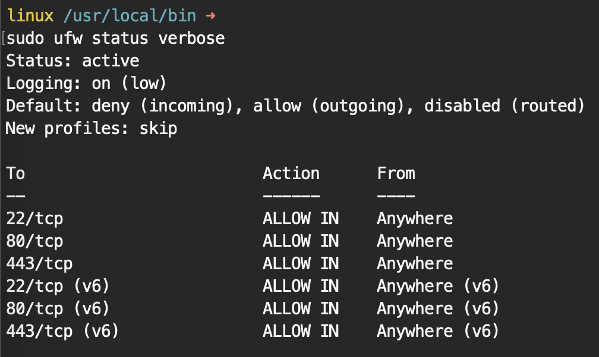
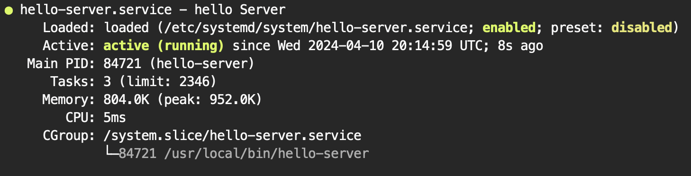
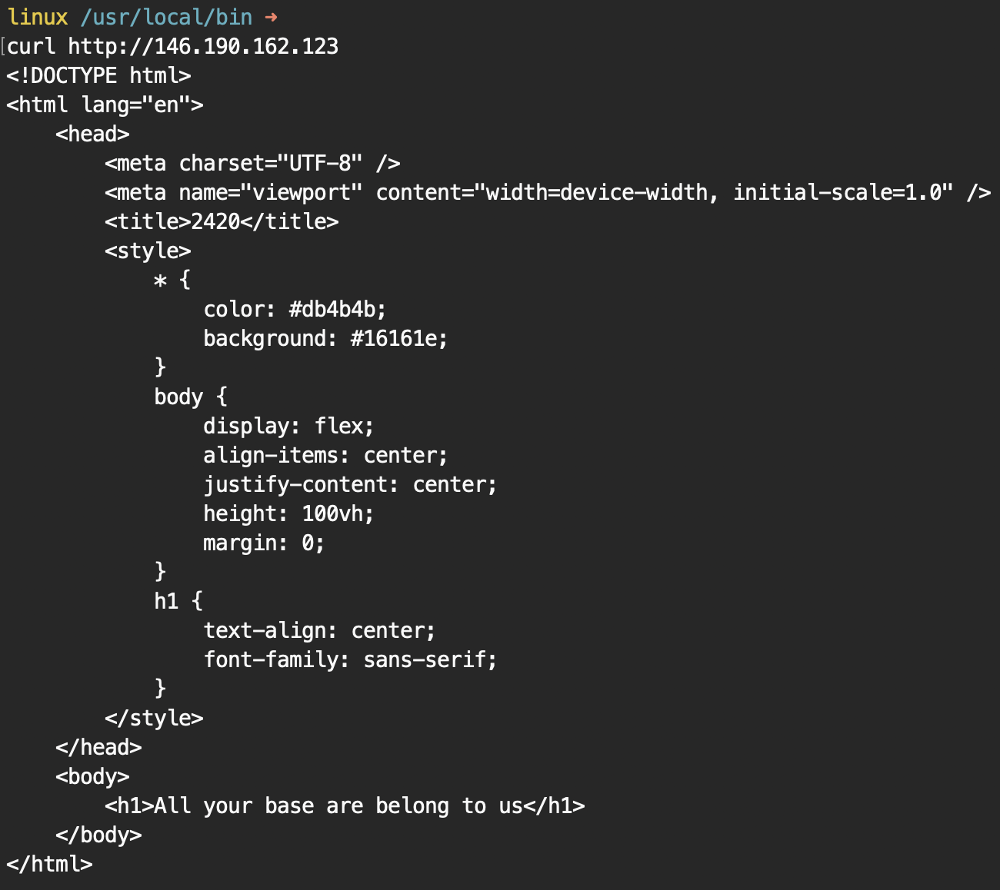
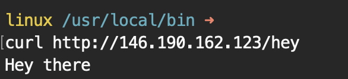
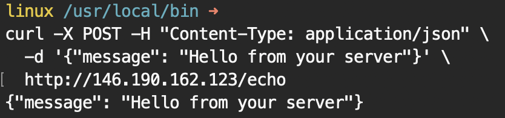

#### Assignment #3 Part 2 - Charley Liao, A00969849, Set B

---

# Setting up a Firewall and Reverse Proxy for Backend Server

## Steps to set-up UFW (Uncomplicated Firewall)

### 1. Install UFW

```bash
sudo pacman -S ufw
```

### 2. Configure UFW

Allow SSH connections:

```bash
sudo ufw allow OpenSSH
```

Allow HTTP and HTTPS traffic:

```bash
sudo ufw allow http
sudo ufw allow https
```

Enable UFW:

```bash
sudo ufw enable
```

Check UFW:

```bash
sudo ufw status verbose
```

#### Screenshot of Enabled UFW w/ proper permission



Port Numbers:

-   22 is SSH
-   80 is HTTP
-   443 is HTTPS

---

## Steps to Configure Reverse Proxy with Nginx

### 1. Install Nginx

**_<p style="text-align: center;">Installation of Nginx is from part one._**

### 2. Configure Reverse Proxy with Nginx

Inside your existing server block

```bash
sudo vim /etc/nginx/sites-available/nginx-2420.conf
```

Add the configuration for `location /hey` and `location /echo` into the `nginx-2420.conf` configuration file:

**Note**: Make sure to replace `<your_server_ip>` with your droplet's public IP address.

```nginx
server {
    listen 80;
    listen [::]:80;
    server_name "<your_server_ip>";

    root /web/html/nginx-2420;
    index index.php index.html index.htm;

    location / {
        try_files $uri $uri/ =404;
    }
    # The above already exists

    # Add the location for /hey and /echo
    location /hey {
        # Proxy Request to :8080/hey
        proxy_pass http://127.0.0.1:8080/hey;

        # Host Header from Original Request
        proxy_set_header Host $host;

        # Set X-Real-IP header to Client's IP Address
        proxy_set_header X-Real-IP $remote_addr;

        # Append Client IP to X-Forwarded Header
        proxy_set_header X-Forwarded-For $proxy_add_x_forwarded_for;

        # Set Protocol to Original Http
        proxy_set_header X-Forwarded-Proto $scheme;
    }

    location /echo {
        proxy_pass http://127.0.0.1:8080/echo;
        proxy_set_header Host $host;
        proxy_set_header X-Real-IP $remote_addr;
        proxy_set_header X-Forwarded-For $proxy_add_x_forwarded_for;
        proxy_set_header X-Forwarded-Proto $scheme;
    }
}
```

Enable the configuration by linking it to `/etc/nginx/sites-enabled/`

**Note**: If it indicates a link has already been made, that is fine.

```bash
sudo ln -s /etc/nginx/sites-available/nginx-2420.conf /etc/nginx/sites-enabled/nginx-2420.conf
```


### 3. Ensure the Configuration has no Errors

Test the Nginx configuration:

```bash
sudo nginx -t
```

When there are no errors, reload Nginx to apply the changes:

```bash
sudo systemctl reload nginx
```

### 4. Place Backend Binary and Create Service File

Install `hello-server` from the course folder to your local computer.

Transfer the `hello-server` binary to your server using SFTP. Place it in a logical location, for example `/usr/local/bin`.

To transfer, do the following:

```bash
sftp username@your_server_ip
```

Enter your password if prompted.

Navigate to the directory containing the `hello-server` binary:

```sftp
lcd /path/to/documents/folder
```

Upload the `hello-server` binary to your server:

```sftp
put hello-server /home/<user>/bin/hello-server
```

**NOTE**: We will move the file to the proper path. sftp does not work with `sudo`.

Exit SFTP:

```sftp
exit
```

SSH back into the droplet and move the file `hello-server` to `/usr/local/bin`:

```bash
sudo mv hello-server /usr/local/bin
```

Next is to change the permission for `hello-server`:

```bash
sudo chmod +x /usr/local/bin/hello-server
```

Now you have the `hello-server` in your `/usr/local/bin/hello-server`, with the proper permission. Continue the next steps.

### 5. Configure the hello-server.service

Create a service file for `hello-server`:

```bash
sudo vim /etc/systemd/system/hello-server.service
```

Add the following content:

```ini
[Unit]
Description=Hello Server
After=network.target

[Service]
Type=simple
ExecStart=/usr/local/bin/hello-server
Restart=on-failure

[Install]
WantedBy=multi-user.target
```

Save and close the file.

### 6. Enable and Start the Service

```bash
sudo systemctl daemon-reload
sudo systemctl start hello-server
sudo systemctl enable hello-server
```

Check the status of the server to see if it is running:

```bash
sudo systemctl status hello-server
```

**NOTE**: Remember to reload `nginx` to allow the changes to run.

```bash
sudo systemctl reload nginx
```

Screenshot showing hello-server.service is running:



### 7. Test Backend Connectivity

You can now test the connectivity to your backend server. Use the tool `curl`. The IP addresses shown below will be changed to your droplet's IP address.

#### Test default "/"

```bash
curl http://146.190.162.123
```

#### The result is:



---

### Test the backend:

#### Test "/hey"

```bash
curl http://146.190.162.123/hey
```

#### The result is:



#### Test /echo:

```bash
curl -X POST -H "Content-Type: application/json" \
  -d '{"message": "Hello from your server"}' \
  http://146.190.162.123/echo
```
#### The result is:



